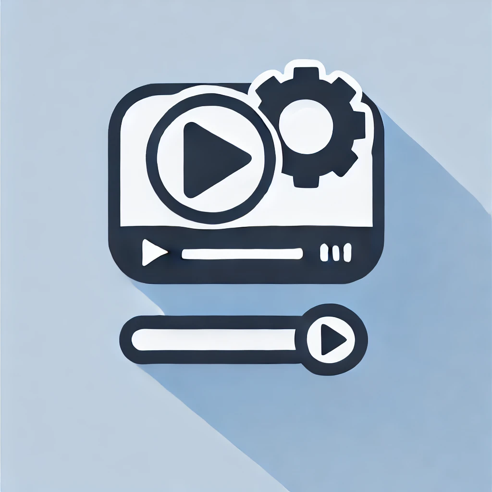

# FRAMEFLUX

  

## 🚀 Introduction
FRAMEFLUX is a powerful and intuitive platform for seamless video processing and automation. Whether you're editing, transcoding, or applying filters, FRAMEFLUX streamlines your workflow with efficiency and precision.

## 🎯 Features
- **Fast Video Processing**: Optimized algorithms for quick editing and transformations.
- **Automation**: Batch processing and scheduling for effortless video management.
- **Custom Filters & Effects**: Apply real-time enhancements to your videos.
- **Cross-Platform Support**: Works on Windows, macOS, and Linux.
- **Intuitive UI**: User-friendly interface for smooth navigation and usability.

## 🤝 Contributing
We welcome contributions! Feel free to submit pull requests, report issues, or suggest new features.

## 📄 License
This project is licensed under the MIT License. See the [LICENSE](LICENSE) file for details.

## 📫 Contact
For any inquiries or support, reach out via [mayanktiwari1212.mt@gmail.com](mailto:mayanktiwari1212.mt@gmail.com) or open an issue on GitHub.

---
### Made with ❤️ by Mayank Tiwari
